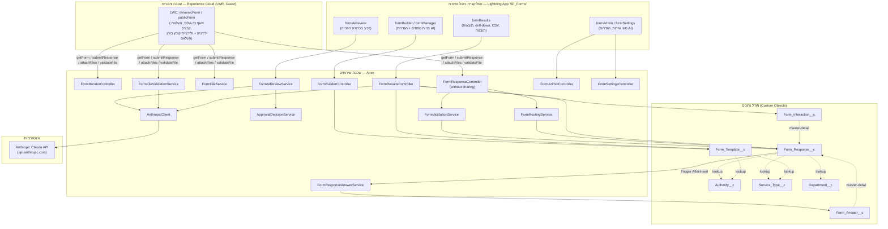
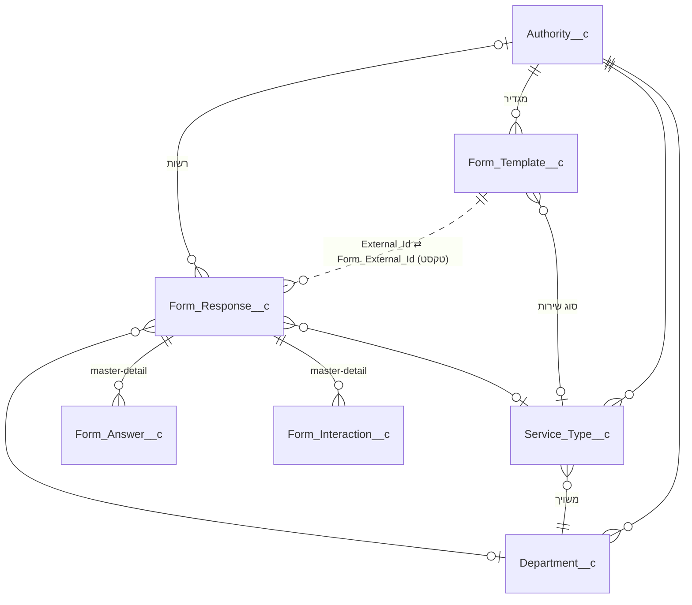
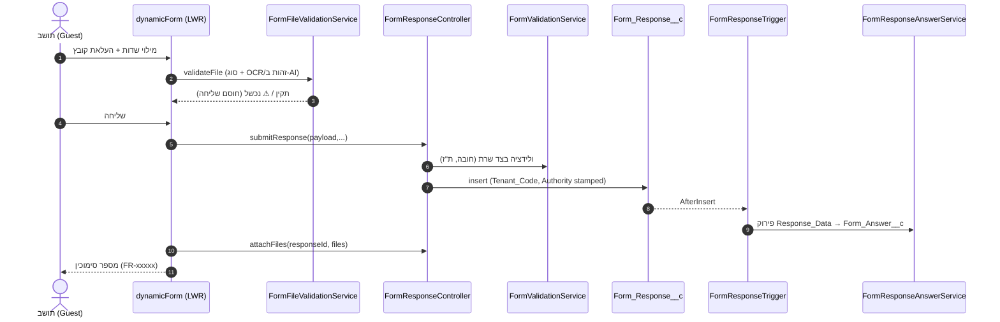
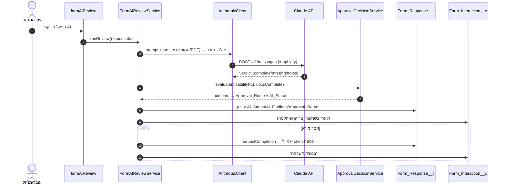
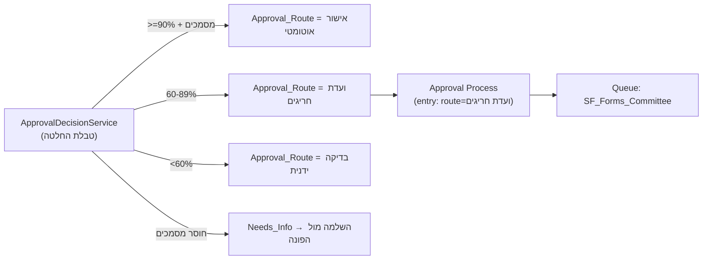
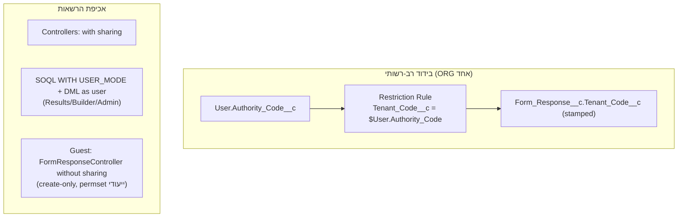

# ארכיטקטורת הפתרון — מחולל טפסים דיגיטליים נייטיבי (Salesforce PSS)

מסמך זה מתאר את הארכיטקטורה המלאה של המערכת כפי שהיא ממומשת בפועל במאגר:
שכבות, מודל נתונים, רכיבים, זרימות מידע, אינטגרציות, מודל אבטחה/רב-רשותיות,
יכולות רישוי PSS, ו-CI/CD.

> מסמכים משלימים: `SOLUTION_ARCHITECTURE.md` (תכנון-על), `PSS_NATIVE_ASSESSMENT.md`
> (הערכת יכולות PSS), `MULTI_AUTHORITY_ISOLATION.md`, `FORM_BUILDER_SPEC.md`,
> `BRE_EXPRESSION_SET_DESIGN.md` / `ACTION_PLANS_DESIGN.md` / `OMNISCRIPT_MIGRATION.md`
> (עיצובים org-side), `DEPLOY.md` (פריסה).

---

## 1. מטרה ועקרונות
- **מחולל טפסים דיגיטליים** לרשות מקומית: יצירת טפסים ללא קוד, פרסום ציבורי, קליטה, בדיקת AI, ניתוב ואישור.
- **Native-first על PSS**: ניצול יכולות הפלטפורמה (Experience Cloud, Restriction Rules, Approval Process, BRE, Action Plans, OmniStudio) לפני פתרונות חיצוניים.
- **עברית/RTL ונגישות (WCAG)** לאורך כל הממשקים.
- **רב-רשותיות תחת ORG אחד** עם בידוד נתונים.
- **AI מבוסס קלוד (Anthropic)** לבדיקה, OCR, ואינטראקציה עם הפונה — עוקף פערי רישוי (Agentforce/IDR).

---

## 2. שכבות המערכת

---

## 3. מודל נתונים (ERD)

### 3.1 אובייקטים ושדות מפתח

| אובייקט | תפקיד | שדות עיקריים |
|---|---|---|
| **Form_Template__c** | הגדרת טופס (מטא-דאטת התוכן) | `External_Id__c` (מפתח ייחודי), `Schema_JSON__c` (שלבים/שדות), `Active__c`, `Description__c`, `Service_Type__c`, `Authority__c`, `AI_Review_Enabled__c`, `AI_Review_Instructions__c`, `AI_Check_Attachments__c`, `AI_Contact_Applicant__c`, `AI_Insights__c`, `AI_Insights_Generated_At__c`, `AI_Insights_Record_Count__c` |
| **Form_Response__c** | הגשה בודדת (פנייה) | `Form_External_Id__c` (טקסט → תבנית), `Response_Data__c` (JSON), `Respondent_Name__c`/`Email__c`/`Phone__c`/`Subject__c`, `Status__c`, `AI_Status__c`, `AI_Findings__c`, `AI_Reviewed_At__c`, `Approval_Route__c`, `Update_Token__c`, `Update_Requested__c`, `Authority__c`, `Authority_Code__c` (formula), `Tenant_Code__c` (stamped), `Department__c`, `Service_Type__c`, `SLA_Due__c`, `Source_IP__c`, `Submitted_At__c` |
| **Form_Answer__c** | תשובה מנורמלת פר-שדה (לדיווח/חיפוש) | master-detail ל-Response; `Field_Key__c`, `Field_Label__c`, `Value_Text__c`, `Value_Number__c`, `Value_Date__c` |
| **Form_Interaction__c** | שרשור התכתבות AI מול הפונה | master-detail ל-Response; `Direction__c` (מערכת/לפונה/מהפונה), `Interaction_Type__c` (בדיקת AI/בקשת השלמה/תשובת פונה/בדיקה חוזרת/אישור/הערה), `Message__c`, `Occurred_At__c` |
| **Authority__c** | רשות מקומית (Tenant) | `Code__c`, `Active__c`, `AI_Engine__c`, `LLM_Endpoint__c`/`LLM_Model__c`/`LLM_API_Key__c` (מנוע פר-רשות), `Public_Site_Base_Url__c` |
| **Service_Type__c** | קטלוג סוגי שירות | `Department__c`, `Default_SLA_Hours__c`, `Active__c`, `Authority__c` |
| **Department__c** | מחלקה מטפלת | `Active__c`, `Authority__c`, `Email__c` |
| **Form_AI_Setting__c** | Hierarchy Custom Setting — הגדרות AI ברירת-מחדל לארגון | `Engine__c`, `LLM_Endpoint__c`, `LLM_Model__c`, `LLM_API_Key__c` |
| **User.Authority_Code__c** | שדה טקסט לבידוד רב-רשותי (השוואת Restriction Rule) | — |

### 3.2 החלטת קישור מרכזית
`Form_Response__c` מקושר לתבנית דרך **שדה טקסט** (`Form_External_Id__c` = `Form_Template__c.External_Id__c`) ולא דרך Lookup — בכוונה: כדי שמשתמש **אורח (Guest)** יוכל להגיש ללא צורך בהרשאות Lookup/FLS מורכבות, ולשמור על צימוד רופף בין תוכן להגשות.

---

## 4. רכיבי תוכנה

### 4.1 Apex — שכבת שירותים
| מחלקה | Sharing | תפקיד |
|---|---|---|
| `FormRenderController` | with | מגיש את התבנית הפעילה לטופס הציבורי (`getForm`) |
| `FormResponseController` | **without** | `submitResponse` — ולידציה + יצירת `Form_Response__c` (מסלול אורח) |
| `FormValidationService` | — | `flattenFields`, `isValidIsraeliId`, ולידציית סכימה |
| `FormFileService` | without | `attachFiles` — ContentVersion + ContentDocumentLink |
| `FormFileValidationService` | without | `validateFile` — בדיקת סוג + אימות תוכן/זהות ב-AI בזמן העלאה |
| `FormResponseTrigger` + `FormResponseAnswerService` | — | AfterInsert → פירוק `Response_Data__c` ל-`Form_Answer__c` |
| `FormRoutingService` | — | ניתוב (מחלקה/SLA) + הטבעת `Tenant_Code__c`/`Authority__c` |
| `FormAIReviewService` | without | `runReview` (בדיקה+OCR+החלטה), `narrate` (תובנות), `requestCompletion` (מייל לפונה), `getReview` |
| `ApprovalDecisionService` | without | טבלת החלטה דטרמיניסטית (סף אחוזי נכות → מסלול) |
| `AnthropicClient` | without | **מקור אמת יחיד** לקריאות Claude (כותרות, גרסה, מולטי-מודל/PDF, `extractText`/`describeApiError`, `orgConfig`) |
| `FormBuilderController` | with (USER_MODE) | CRUD לתבניות + הגדרות AI |
| `FormResultsController` | with (USER_MODE) | אגרגציה, תובנות (שמירה), drill-down, `listResponses`/`getResponseDetail` |
| `FormAdminController` | with (USER_MODE) | סוגי שירות + מחלקות |
| `FormSettingsController` | with | הגדרות מנוע AI ברמת הארגון |

### 4.2 LWC — ממשקי משתמש
| רכיב | מיקום | תפקיד |
|---|---|---|
| `dynamicForm` / `publicForm` | Experience Cloud (ציבורי) | מנוע הטופס: אשף רב-שלבי, `?formId=`, העלאת קבצים, ולידציה + חיווי אינליין, ולידציית קובץ בזמן העלאה |
| `formBuilder` | טאב Builder | בניית/עריכת תבנית, הגדרות AI פר-טופס |
| `formManager` | טאב Manage | רשימת טפסים וניהול |
| `formResults` | טאב Results | רשימה→פירוט→רשומה בודדת, גרפים, תובנות, CSV, צבעי סטטוס |
| `formAdmin` | טאב Admin | סוגי שירות + הטמעת `formSettings` |
| `formSettings` | טאב Settings | בחירת מנוע AI + פרטי חיבור |
| `formAiReview` | דף רשומה `Form_Response__c` | הרצת בדיקת AI ובקשת השלמה מהפונה |

### 4.3 קונפיגורציה ומטא-דאטה תומכת
- **Custom Tabs / FlexiPages**: `SF_Forms_Home/Builder/Manage/Results/Admin/Settings` + Lightning App `SF_Forms`.
- **Permission Sets**: `SF_Forms_Manager` (משתמשים פנימיים, CRUD/FLS מלא), `SF_Forms_Public_Submit` (אורח — create בלבד + read לתבנית).
- **Custom Label**: `Form_Public_Site_Base_Url` (בסיס כתובת האתר הציבורי).
- **Remote Site Setting**: `Anthropic_API` (allowlist ל-api.anthropic.com).
- **Queue**: `SF_Forms_Committee` (יעד Approval Process).
- **Approval Process**: `Form_Response__c.Exceptions_Committee` (route=ועדת חריגים).

---

## 5. זרימות מידע

### 5.1 הגשת טופס ציבורי + קליטה

### 5.2 בדיקת AI + OCR + החלטת ניתוב

### 5.3 ניתוב ואישור (Native Approval)

### 5.4 תובנות ותוצאות
`formResults` → `FormResultsController.getResults` (אגרגציה + KPI + גרפים) → `generateAiInsights` (Claude דרך `AnthropicClient.narrate`, נשמר על התבנית עם תאריך+ספירה) → drill-down `getResponseDetail` (שדות + קבצים + שרשור AI) → ייצוא CSV.

---

## 6. מודל אבטחה ורב-רשותיות

- **בידוד רשויות:** Restriction Rules על `Form_Response__c` משוות `Tenant_Code__c` (מוטבע בקליטה) ל-`$User.Authority_Code__c`. מנהלי-על עוקפים ← יש לבדוק כמשתמש רשות. הרחבה: כלל פר-רשות + Sharing Sets ל-Experience.
- **אכיפת FLS/CRUD:** כל שלושת הקונטרולרים הפנימיים אוכפים `WITH USER_MODE`/`as user`; מסלול ההגשה הציבורי נשאר במצב מערכת בכוונה (אורח).
- **הרשאות:** `SF_Forms_Manager` (פנימי), `SF_Forms_Public_Submit` (אורח, create-only).
- **סודות:** מפתח ה-LLM נשמר ב-Custom Setting/רשות ואינו מוחזר ללקוח (רק דגל `hasApiKey`). מומלץ מעבר ל-Named/External Credential בפרודקשן.

---

## 7. אינטגרציה — Anthropic Claude
- **נקודת קצה:** `https://api.anthropic.com/v1/messages` (Remote Site `Anthropic_API`), כותרות `x-api-key` + `anthropic-version`; ל-PDF נוסף `anthropic-beta`.
- **ריכוז:** כל הקריאות עוברות דרך `AnthropicClient` (מקור אמת יחיד).
- **שימושים:** (1) בדיקת הגשה + OCR מולטי-מודלי של צרופות; (2) ולידציית קובץ בזמן העלאה; (3) הפקת תובנות בתוצאות.
- **קונפיג:** ברירת מחדל ארגונית (`Form_AI_Setting__c`) עם עקיפה פר-רשות (`Authority__c.LLM_*`).
- **חוסן:** טיפול שגיאות קריא (יתרת קרדיט/מפתח), נפילה חיננית לסיכום מבוסס-כללים כשאין מנוע.

---

## 8. יכולות רישוי PSS — שימוש בפועל מול פוטנציאל

| יכולת PSS/Platform | סטטוס במערכת |
|---|---|
| **Experience Cloud (LWR)** | ✅ בשימוש — אתר ציבורי לטפסים |
| **Restriction Rules / Sharing** | ✅ בשימוש — בידוד רב-רשותי |
| **Approval Processes + Queues** | ✅ בשימוש — ועדת חריגים |
| **Business Rules Engine (BRE)** | 🟨 מיושם כ-Apex Decision Table; עיצוב Expression Set נייטיבי מוכן (`docs/BRE_...`) |
| **Action Plans** | 🟨 עיצוב תבנית מוכן (`docs/ACTION_PLANS_DESIGN.md`) — דורש הפעלת האובייקט |
| **OmniStudio (OmniScript/FlexCards)** | 🟨 זמין; מסלול הסבה מתועד (`docs/OMNISCRIPT_MIGRATION.md`) |
| **Document Checklist Items (DCI)** | 🟨 זמין חלקית (DocumentChecklistItem) |
| **Case Management + Entitlements/Milestones** | ◻️ זמין — פוטנציאל ל-SLA/ניתוב מתקדם |
| **Public Sector Intake (IndividualApplication)** | ◻️ זמין — פוטנציאל לאימוץ מודל אינטייק מלא |
| **Einstein / Agentforce GenAI** | ❌ לא מורשה — **עוקף דרך Claude** ללא רגרסיה |
| **Intelligent Document Reader (OCR נייטיבי)** | ❌ לא מורשה — **עוקף דרך OCR של Claude** |

> ✅ בשימוש · 🟨 מיושם חלקית/מתועד להפעלה · ◻️ זמין (פוטנציאל) · ❌ חסום ברישוי (נעקף)

---

## 9. CI/CD ופריסה
- **מאגר DX** תחת `force-app/main/default`, API v62.0.
- **GitHub Actions:**
  - `Deploy to org` — פריסה אמיתית ל-Sandbox + assign permset + smoke test (מופעל ע"י bump ל-`ops/deploy.trigger`).
  - `Validate against org` — dry-run + בדיקות על שינויי `force-app/**`.
  - `Salesforce CI` — scratch org (מדלג אם אין `DEVHUB_SFDX_AUTH_URL`).
- **בדיקות:** `RunSpecifiedTests` עם רשימה ממוקדת (7 מחלקות) — **מכוון**: הארגון מכיל בדיקות זרות כושלות מראש, כך ש-`RunLocalTests` אינו בר-שימוש כאן.
- **סוד נדרש:** `SF_AUTH_URL` (auth URL של ארגון היעד).

---

## 10. מפת דרכים (org-side / עתידי)
1. הפעלת **Action Plans** לאובייקט `Form_Response__c` ובניית התבנית → הקמת שרשרת משימות אוטומטית.
2. בניית **BRE Expression Set** ב-Builder ו-Retrieve ל-source (החלפת ה-Apex Decision Table).
3. הסבת טפסים ל-**OmniScript** (גל הדרגתי).
4. שקילת אימוץ **Public Sector Intake** (IndividualApplication) לתהליכים מורכבים.
5. חיזוק אבטחה: מעבר מפתח ל-**Named/External Credential**; Sharing Sets ל-Experience.
6. הפעלת **Einstein/Agentforce + IDR** אם/כאשר יורשו — החלפה נקייה של שכבת ה-Claude.
