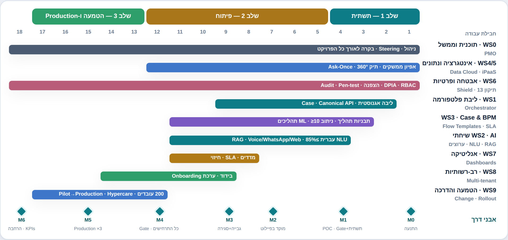
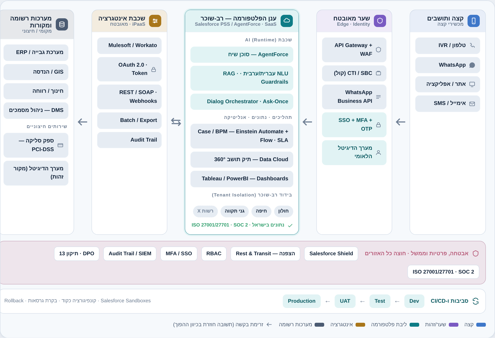

# תוכנית מימוש מלאה — MUNI FORCE

**פלטפורמת AI לשירות ולניהול תהליכים ברשויות מקומיות**
**גרסה:** 1.0 · **גוף מוביל:** עיריית חולון · **משך:** 18 חודשים · **מסלול:** תמיכה ב' (עד ₪1,500,000)
**מסמך מלווה:** [אפיון מלא — AI_Platform_Spec](AI_Platform_Spec.md)

---

## 0. תקציר מנהלים

תוכנית זו מתרגמת את האפיון ליישום מלא, מקצה-לקצה. הגישה:

- **Agile, פרוסה לפרוסות (thin vertical slices):** כל תרחיש (גבייה, מוקד, ועדות, טיפול-עד-סגירה) נבנה end-to-end דרך כל השכבות — ולא שכבה-שכבה — כדי להגיע לערך מוקדם ולהפחית סיכון.
- **Pilot-first:** שחרור מוקדם לסביבת פיילוט ב-3 מחלקות, ואז הרחבה ל-Production.
- **Config-first:** כל רשות/מחלקה עולה דרך קונפיגורציה ותבניות (Flow Templates), לא דרך פיתוח מחדש — כך שהמערכת רב-רשותית מיום ראשון.
- **Security & Privacy by design:** תיקון 13, RBAC, הצפנה ו-Audit מוטמעים בכל פרוסה, לא כשלב מאוחר.

היעד: מערכת חיה ב-Production ב-3 מחלקות בתום 18 חודשים, ≥10 תהליכי שירות באוטומציה, ועמידה ביעדי ה-KPI (80% שירות עצמי, ‎30%↓ פניות מוקד, 20%↑ שביעות רצון, ≥85% דיוק NLU).

---

## 1. עקרונות ומתודולוגיה

| עיקרון | יישום |
|--------|--------|
| ספרינטים | Scrum, ספרינטים דו-שבועיים, Backlog מנוהל, Review + Retro לכל ספרינט |
| ממשל | Steering דו-שבועי, בקרת תקציב ולו"ז, שערי Go/No-Go באבני דרך |
| פרוסות אנכיות | כל Epic חוצה את כל השכבות (ערוץ → NLU → תהליך → אינטגרציה → סגירה) |
| DevOps | Sandbox-first, CI/CD, קידום דרך dev → test → UAT → prod, כל שינוי נבדק אוטומטית |
| קונפיגורציה כקוד | תבניות תהליך, סכימת קונפיגורציה ובסיסי ידע מנוהלים ב-repo וגרסאות |
| איכות מובנית | Definition of Done כולל בדיקות, אבטחה, נגישות ותיעוד לכל סיפור |

---

## 2. חבילות עבודה (Workstreams)

| WS | חבילת עבודה | תכולה עיקרית | תוצרי מפתח |
|----|--------------|---------------|-------------|
| **WS0** | תוכנית וממשל (PMO) | לו"ז, תקציב, סיכונים, ספקים, Steering | תוכנית עבודה, בקרת אבני דרך |
| **WS1** | ליבת פלטפורמה ו-Orchestration | מנוע השיח, Dialog Orchestrator, שכבת פעולות | ליבה אגנוסטית, Canonical API |
| **WS2** | AI שיחתי (NLU/RAG/ערוצים) | NLU עברית/ערבית, RAG, Guardrails, Voice/WhatsApp/Web | מנוע הבנה, בסיסי ידע, ערוצים |
| **WS3** | Case & BPM | Flow Templates, ניתוב ML, מנוע SLA, Human-in-loop | תבניות תהליך, מנוע Case |
| **WS4** | אינטגרציות ו-iPaaS | Mulesoft/Workato, Salesforce, הזדהות לאומית, סליקה | ממשקים, זרימות אינטגרציה |
| **WS5** | נתונים ו-Ask-Once | Data Cloud, תיק 360°, Identity Resolution, Data Governance | תיק תושב 360°, מנוע Ask-Once |
| **WS6** | אבטחה, פרטיות ורגולציה | תיקון 13, RBAC, Shield/הצפנה, Audit, DPO, pen-test | תסקיר השפעה, בקרות, תקינה |
| **WS7** | אנליטיקה ו-KPIs | Dashboards (Tableau/PowerBI), מדדים, חיזוי | לוחות בקרה, דוחות אמת |
| **WS8** | רב-רשותיות וקונפיגורציה | סכימת tenant, ערכת Onboarding, בידוד נתונים | מסגרת multi-tenant |
| **WS9** | ניהול שינוי, הדרכה והטמעה | שגרירי חדשנות, הדרכות, playbooks, hypercare | תוכנית הטמעה, חומרי הדרכה |

---

## 3. תוכנית שלבים ואבני דרך (18 חודשים)

*מפת דרכים: שלושה שלבים, חבילות עבודה במקביל, ואבני דרך M0–M6.*

### שלב 1 — אפיון ותשתית (חודשים 1–4)
| חבילה | פעילות | תוצר |
|--------|--------|------|
| WS0 | הקמת PMO, Steering, ובחירת ספק/שותף מטמיע | אמנת פרויקט, לו"ז מפורט |
| WS4/WS5 | אפיון ממשקים, הקמת Data Cloud, אינטגרציה ראשונית ל-CRM/ERP | סביבת פיתוח + מודל 360° ראשוני |
| WS6 | תסקיר השפעה על הפרטיות (DPIA), מיפוי מאגרים, מינוי DPO | מסמך DPIA, מדיניות הרשאות |
| WS3 | אפיון BPM, דרישות SLA, תבנית תהליך ראשונה | הגדרות תהליך, SLA |
| WS1/WS2 | הקמת סביבת פיילוט (AgentForce/PSS), הוכחת היתכנות NLU עברית | POC שיחתי |
| — | **🚩 אבן דרך M1 (סוף חודש 4):** תשתית + POC מאושרים — **שער Go/No-Go** | |

### שלב 2 — פיתוח והטמעה (חודשים 5–12)
| חבילה | פעילות | תוצר |
|--------|--------|------|
| WS2 | NLU עברית + Intent + Entities + Sentiment; RAG לבסיס ידע; Guardrails | דיוק זיהוי ≥85% |
| WS1/WS3 | Dialog Orchestrator + מנוע Case + ניתוב ML + Human-in-loop | פרוסה end-to-end ראשונה |
| WS2 | ערוצים: Voice/IVR, WhatsApp, Web, Email/SMS + המשכיות שיח | Omni-channel פעיל |
| WS4/WS5 | חיבור Data Cloud לכלל המקורות; Ask-Once מלא; הזדהות לאומית; סליקה PCI | תיק 360° + Ask-Once |
| WS3 | בניית **≥10 תהליכי שירות** באוטומציה (Flow Templates) | תהליכים פעילים |
| WS7 | Dashboards, מדדי SLA, חיזוי | לוחות בקרה |
| — | **🚩 M2 (ח' 7):** תרחיש דגל ראשון (מוקד מידע) חי בפיילוט | |
| — | **🚩 M3 (ח' 9):** גבייה קולי + טיפול-עד-סגירה בפיילוט | |
| — | **🚩 M4 (ח' 12):** ליווי ועדות + כל 3+3 התרחישים בפיילוט; **שער Go/No-Go ל-Production** | |

### שלב 3 — הדרכה, הרצה ו-Production (חודשים 13–18)
| חבילה | פעילות | תוצר |
|--------|--------|------|
| WS9 | הכשרת ~200 עובדים (יעד 80% שביעות רצון), שגרירי חדשנות, playbooks | עובדים מוכשרים |
| WS1–WS7 | מעבר Pilot→Production ב-3 מחלקות ראשונות (100%), Hypercare | מערכת חיה |
| WS6 | Pen-test, מוכנות ISO/SOC, סקירת אבטחה סופית | אישור אבטחה |
| WS8 | ערכת Onboarding לרשות/מחלקה נוספת (config-only) | מסגרת הרחבה |
| — | **🚩 M5 (ח' 15):** Production ב-3 מחלקות | |
| — | **🚩 M6 (ח' 18):** ייצוב, עמידה ב-KPIs, מוכנות להרחבה | |

---

## 4. סדר בנייה מפורט (Build Order / Backlog)

הבנייה מאורגנת ב-Epics, כל אחד פרוסה אנכית מלאה. סדר עדיפויות לפי ערך וסיכון:

| # | Epic | פרוסה (End-to-End) | תלות | שלב יעד |
|---|------|---------------------|------|----------|
| E1 | תשתית ליבה + Canonical API | שלד Orchestrator + Case + Audit | — | 1 |
| E2 | ערוץ + NLU בסיסי | WhatsApp/Web → Intent → תשובת RAG | E1 | 2 (M2) |
| E3 | מוקד מידע (תרחיש ב') | מענה מבוסס-מקור + פתיחת קריאה + הסלמה | E2 | 2 (M2) |
| E4 | הזדהות + Ask-Once + תיק 360° | הזדהות לאומית + שליפה מ-Data Cloud | E1, WS5 | 2 |
| E5 | גבייה קולי (תרחיש א') | Voice/IVR + חוב + הסדר + סליקה PCI | E4 | 2 (M3) |
| E6 | טיפול-עד-סגירה (הנחה/חינוך) | זכאות אוטומטית → פעולה → סיכום → סגירה | E4 | 2 (M3) |
| E7 | ליווי ועדות (תרחיש ג') | Case רב-מחלקתי + SLA + עדכון יזום + החלטה | E1, WS3 | 2 (M4) |
| E8 | רווחה (טיפול עם אישור אנושי) | ניהול חסוי + הכנת תיק + Human decision + סגירה | E4, E7 | 2 (M4) |
| E9 | רב-לשוני (ערבית) | זיהוי שפה + מענה בערבית על גבי E2–E8 | E2 | 2 |
| E10 | אנליטיקה וחיזוי | Dashboards + מדדי SLA + חיזוי עומסים | E3–E8 | 2 |
| E11 | Multi-tenancy & Onboarding | סכימת tenant + בידוד + ערכת עלייה | E1 | 2–3 |
| E12 | הקשחה, נגישות ו-Production | pen-test, WCAG, Hypercare | הכל | 3 |

---

## 5. פירוט טכני למימוש

### 5.1 סביבות ו-DevOps
- **סביבות:** Dev → Test → UAT → Production, כולל Salesforce Sandboxes (Developer/Partial/Full).
- **CI/CD:** בקרת גרסאות ל-metadata וקונפיגורציה, deployment אוטומטי, בדיקות אוטומטיות בכל קידום, מנגנון rollback.
- **Config-as-code:** תבניות תהליך, סכימת קונפיגורציה ובסיסי ידע מנוהלים בגרסאות; שינוי רשות = שינוי קונפיגורציה מבוקר.
- **Observability:** לוגים, מטריקות, התראות, ו-Audit Trail מרכזי.

### 5.2 מודל נתונים — יישום
- **Canonical → מיפוי:** ישויות Resident / Case / Conversation / KnowledgeItem / ActionAudit ממופות לאובייקטים ב-Salesforce ול-DMOs ב-Data Cloud.
- **Identity Resolution:** איחוד רשומות תושב ממקורות שונים (גבייה, חינוך, רווחה, הנדסה) למפתח תושב אחד.
- **Ask-Once:** שכבת שליפה שבודקת קיום מידע לפני כל בקשה מהתושב; מדיניות גישה מבוססת-מטרה.
- **`tenantId` בכל ישות** לבידוד רב-רשותי; `purpose`/`consent` לתאימות תיקון 13.

### 5.3 שכבת ה-AI השיחתי
- **NLU עברית/ערבית:** מודל מותאם; מנגנון הערכה (evaluation harness) עם golden sets; שער איכות ≥85% דיוק Intent.
- **RAG:** צנרת קליטת מסמכי רשות → chunking → embeddings → אחזור עם ציטוט מקור (grounding) למניעת הזיות; עדכון תוכן ע"י הרשות ללא פיתוח.
- **Dialog:** ניהול מצב רב-תורי, slot-filling עם דילוג Ask-Once, מצבי בירור/איסוף/אישור/ביצוע/מסירה.
- **Voice:** STT/TTS עברית, barge-in, אינטגרציית טלפוניה/CTI, fallback לנציג.
- **Guardrails:** סינון תוכן, איסור ייעוץ מחייב, שקיפות ("סוכן AI"), הסלמה אוטומטית בנושאים רגישים; red-teaming.

### 5.4 Case / BPM
- **Flow Templates:** ספריית תהליכים גנריים (היתר בנייה, הסדר חוב, מלגה, רווחה, רישום חינוך, הנחה) הניתנים לקונפיגורציה per-tenant.
- **ניתוב ML:** תיוג ותעדוף אוטומטי למחלקה/ועדה.
- **מנוע SLA:** זמן לכל שלב, זיהוי חריגה, תזכורות ועדכון יזום.
- **Human-in-the-loop:** משימות אישור אנושי להחלטות מהותיות; המערכת מכינה, מסכמת וסוגרת.

### 5.5 אינטגרציות
- **חוזי API:** REST/SOAP, OAuth 2.0, Token Refresh, Webhooks, Batch; טיפול בשגיאות ו-idempotency.
- **iPaaS:** זרימות Mulesoft/Workato בין הליבה למערכות (גבייה/ERP, GIS/הנדסה, חינוך/רווחה, DMS).
- **הזדהות לאומית:** אינטגרציה למערך הדיגיטל הממשלתי + OTP.
- **סליקה:** דרך ספק מורשה PCI-DSS; המערכת אינה מאחסנת פרטי אשראי.

### 5.6 רב-רשותיות וקונפיגורציה
- **סכימת קונפיגורציה per-tenant:** שירותים, תהליכים, מדיניות גבייה, מיתוג, ערוצים, שפות, בסיס ידע.
- **בידוד נתונים מלא** בין רשויות; ניהול מרכזי.
- **ערכת Onboarding:** תהליך עלייה מתועד לרשות/מחלקה חדשה (config-only).

### 5.7 בקרות ובטיחות (Guardrails)
- מדיניות תוכן ובטיחות, כללי הסלמה, ומנגנון הערכה שוטף (eval/red-teaming) לפני כל שחרור.

### 5.8 ארכיטקטורת פריסה (Deployment / Topology)

*פריסה: זרימת הבקשה מהתושב (ימין) דרך שער מאובטח, ליבת פלטפורמה רב-שוכרת בענן, שכבת אינטגרציה ומערכות הרשומה (שמאל); שכבת אבטחה וממשל חוצה את כל האזורים.*

- **אזורי אמון (Trust Zones):** קצה ותושבים → שער מאובטח (API Gateway/WAF, CTI/SBC לקול, WhatsApp Business API) והזדהות (SSO + MFA + מערך הדיגיטל הלאומי) → ליבת הפלטפורמה בענן → שכבת אינטגרציה (iPaaS) → מערכות רשומה ומקורות. כל אינטראקציה עוברת דרך השער; פעולות רגישות מחייבות אימות זהות.
- **ליבה רב-שוכרת (Multi-tenant):** Salesforce PSS/AgentForce כ-SaaS, עם שכבת AI (NLU/RAG/Dialog/Guardrails), Case/BPM, Data Cloud (תיק 360°) ואנליטיקה — עם **בידוד נתונים מלא לכל רשות** (חולון, חיפה, גני תקווה, ורשויות נוספות).
- **מקורות ושירותים חיצוניים:** מערכת גבייה/ERP, GIS/הנדסה, חינוך/רווחה, DMS, ספק סליקה PCI-DSS, ומערך הדיגיטל כמקור זהות — כולם דרך ה-iPaaS עם OAuth ו-Audit.
- **אבטחה חוצת-אזורים:** Salesforce Shield, הצפנה (Rest & Transit), RBAC, MFA/SSO, Audit Trail/SIEM, DPO/תיקון 13, ותקינה ISO 27001/27701 ו-SOC 2. נתונים נשמרים בישראל בהתאם לרגולציה.
- **סביבות ו-CI/CD:** קידום מבוקר Dev → Test → UAT → Production על גבי Salesforce Sandboxes, קונפיגורציה כקוד, בקרת גרסאות ו-Rollback.

---

## 6. אבטחה, פרטיות ורגולציה — תוכנית עבודה

| פעילות | שלב | תוצר |
|--------|-----|------|
| תסקיר השפעה על הפרטיות (DPIA) + מיפוי מאגרים | 1 | מסמך DPIA מאושר |
| מינוי DPO וקביעת בסיס חוקי לעיבוד + ניהול הסכמות | 1 | מדיניות פרטיות |
| עיצוב RBAC + MFA/SSO | 1–2 | מטריצת הרשאות |
| הצפנה (Rest & Transit) + Salesforce Shield/KMS | 2 | בקרות מוטמעות |
| Audit Trail מלא + מדיניות Data Retention | 2 | תיעוד ושמירה לפי חוק |
| מבחני חדירה (Pen-test) + הקשחה | 3 | דוח + תיקונים |
| מוכנות ISO 27001/27701, SOC 2 | 2–3 | פערים וסגירה |
| Checklist תיקון 13 (זכויות מושא המידע: עיון/תיקון/מחיקה) | לאורך | עמידה מלאה |

---

## 7. אסטרטגיית בדיקות ואיכות (QA)

| רמה | תכולה | שער איכות |
|------|--------|-----------|
| יחידה ואינטגרציה | לוגיקה, ממשקים, זרימות | כיסוי מוגדר, ירוק ב-CI |
| E2E | תרחישים מקצה-לקצה בכל ערוץ | כל Epic עובר תסריט מלא |
| בדיקת שיחה (NLU/RAG) | golden sets, דיוק Intent, שיעור הזיות | דיוק ≥85%, הזיות ≪ סף |
| UAT | קבלה ע"י מחלקות הרשות | חתימת בעלי עניין |
| עומס וביצועים | זמני מענה, עומסים | עמידה ב-SLA |
| אבטחה | pen-test, סריקות | ללא ממצאים קריטיים |
| נגישות | תקן ישראלי 5568 / WCAG 2.1 AA | תאימות |

**קבלת פיילוט:** כל תרחיש נמדד מול ה-KPI הרלוונטי (זמן מענה, שירות עצמי, שביעות רצון) לפני קידום ל-Production.

---

## 8. הטמעה, ניהול שינוי והדרכה

- **שגרירי חדשנות** בכל מחלקה כמובילי אימוץ.
- **הדרכת ~200 עובדים** (יעד 80% שביעות רצון מההדרכה), חומרי הדרכה ו-playbooks.
- **Hypercare** בתקופת המעבר ל-Production (ניטור צמוד, תמיכה מוגברת).
- **תקשורת פנים-ארגונית** ותצוגת "שגרירי חדשנות".
- **הרצה מדורגת:** Pilot ב-3 מחלקות → Production → הרחבה.

---

## 9. תוכנית הרחבה רב-רשותית

- **תהליך עלייה (Onboarding):** מבוסס קונפיגורציה בלבד — הגדרת שירותים, תהליכים, בסיס ידע ומיתוג לרשות; אין צורך בפיתוח תשתיתי חדש לרוב הרכיבים.
- **הערכת מאמץ:** רשות ראשונה ~₪400–600K; רשות/מחלקה נוספת ~₪50K–₪200K בזכות התשתית המשותפת.
- **מודל שירות משותף (SaaS):** אותה תשתית לכלל הרשויות, עם SLA וזהות נפרדים לכל רשות.

---

## 10. צוות, תפקידים ו-RACI

**היקף:** ~3.5 משרות בשלב הפיתוח, ~1.5 בתפעול שוטף (בהתאם לאפיון), בליווי ספק מטמיע.

| תפקיד | היקף | אחריות מרכזית |
|--------|------|----------------|
| מנהל פרויקט (רשות) | 100% | לו"ז, תקציב, ספקים, Steering |
| ארכיטקט / מוביל טכנולוגי | 50% | ארכיטקטורה, ממשקים, אינטגרציה |
| מוביל Data Governance | 50% | מבנה מידע, איכות, בטחת נתונים |
| מוביל שירות | 50% | תהליכים, תסריטי שיח, מדדים |
| מנהל שינוי והדרכה | 50% | הטמעה והדרכה |
| DPO / ממונה פרטיות | חלקי | תאימות תיקון 13, ממשקי ספקים |
| ספק מטמיע (Vendor) | — | פיתוח, אינטגרציה, NLP עברית |

**RACI (דוגמאות):** אבטחת מידע — DPO (A), ספק (R), מנמ"ר (C); בניית תהליך — מוביל שירות (A), ספק (R), מחלקה (C); הזדהות לאומית — ארכיטקט (A), ספק (R), אבטחה (C).

---

## 11. מיפוי תקציב לאבני דרך

**סך תמיכה מבוקשת:** ₪1,500,000 · **השתתפות עצמית (30%):** ₪450,000 · **סה"כ:** ₪1,950,000.

| קטגוריה תקציבית (לפי האפיון) | שלב עיקרי | אבן דרך |
|------------------------------|-----------|----------|
| השלמת אפיון BPM/דרישות/SLA (100%) | 1 | M1 |
| ארכיטקטורת מידע + אינטגרציה (Mulesoft/Workato + Data Cloud) | 1–2 | M1–M2 |
| בחירת ספק והקמת סביבת פיילוט | 1 | M1 |
| פיתוח AgentForce + NLP + Ask-Once (דיוק 85%) | 2 | M2–M4 |
| חיבור Data Cloud למערכות ERP/CRM (90% מידע בתיק אחד) | 2 | M2 |
| בניית ≥10 תהליכי שירות (Einstein Automate + Flow) | 2 | M4 |
| Dashboards (Tableau/PowerBI) | 2 | M4 |
| הדרכה והטמעה (200 עובדים, 80% שביעות רצון) | 3 | M5 |
| מעבר ל-Production ב-3 מחלקות | 3 | M5–M6 |

בקרת עלויות מול אבני דרך ב-Steering דו-שבועי; פירוט שורות מלא — במסמך התקציב (מסמך ב').

---

## 12. סיכונים, תלויות ושערי החלטה

### תלויות מרכזיות
- זמינות Salesforce Sandbox ורישוי; גישה למערך הדיגיטל הלאומי; ממשקים למערכות ותיקות (גבייה/הנדסה); איכות נתוני מקור.

### סיכונים ומענה (תמצית)
| סיכון | מענה |
|--------|------|
| איכות נתונים | טיוב לפני חיבור Data Cloud; Data Governance |
| אי-תאימות למערכות ותיקות | Mulesoft/Workato; אפיון ממשקים מוקדם; פיילוט |
| התנגדות עובדים | ניהול שינוי; שגרירי חדשנות; הדרכה |
| Vendor Lock-in | ליבה אגנוסטית; ארכיטקטורה פתוחה |
| NLP בעברית | מודל מותאם; evaluation harness; Salesforce Israel |
| פרטיות/דליפה | Shield; RBAC; DPO; תיקון 13 |
| חריגת לו"ז/תקציב | Agile; Steering דו-שבועי; בקרה |

### שערי Go/No-Go
- **M1 (ח' 4):** תשתית + POC + DPIA מאושרים → אישור מעבר לפיתוח.
- **M4 (ח' 12):** כל התרחישים בפיילוט + עמידה ראשונית ב-KPIs → אישור מעבר ל-Production.
- **M6 (ח' 18):** עמידה ב-KPIs + אבטחה → אישור הרחבה.

---

## 13. אבני דרך ותוצרים — סיכום

| אבן דרך | חודש | תוצר עיקרי | קריטריון קבלה |
|----------|------|-------------|----------------|
| **M0** | 0 | התנעה, PMO, אמנת פרויקט | Steering פעיל |
| **M1** | 4 | תשתית + POC + DPIA | שער Go/No-Go |
| **M2** | 7 | מוקד מידע חי בפיילוט | פעולה E2E + ציטוט מקור |
| **M3** | 9 | גבייה קולי + טיפול-עד-סגירה בפיילוט | סליקה + סיכום וסגירה |
| **M4** | 12 | כל התרחישים + ≥10 תהליכים בפיילוט | דיוק NLU ≥85%; שער ל-Production |
| **M5** | 15 | Production ב-3 מחלקות + הדרכת 200 עובדים | 80% שביעות רצון הדרכה |
| **M6** | 18 | ייצוב + עמידה ב-KPIs + מוכנות הרחבה | KPIs מושגים; אבטחה מאושרת |

---

## נספח א' — Definition of Done (לכל סיפור)
קוד/קונפיגורציה נבדקו · בדיקות אוטומטיות ירוקות · בקרות אבטחה והרשאות · נגישות · תיעוד ותסריטי שיח · Audit מופעל · אושר ב-UAT.

## נספח ב' — מסמכים מלווים
[אפיון מלא (AI_Platform_Spec)](AI_Platform_Spec.md) · [עמוד יכולות ויזואלי (capabilities)](capabilities.html) · מסמך תקציב (מסמך ב').

*תוכנית זו היא מסמך חי; פרטי ספרינטים, חוזי API ומיפוי שדות יושלמו בשלב האפיון המפורט ובתחילת כל שלב.*

