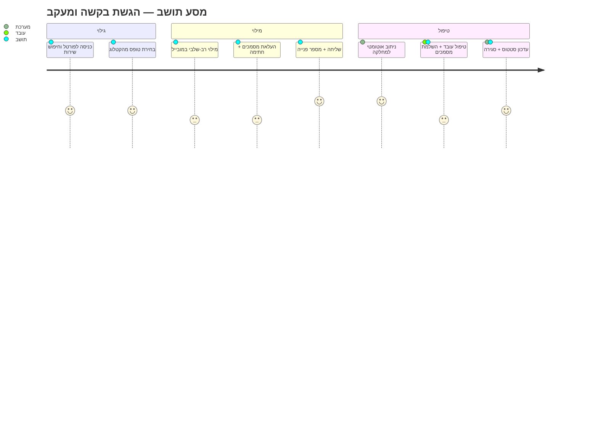
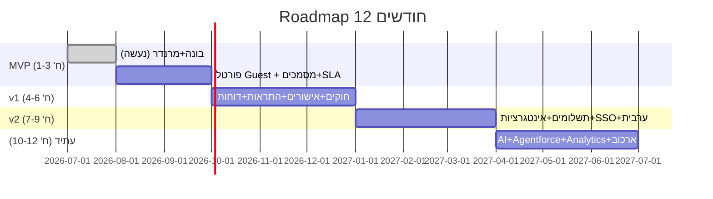

# Enterprise PRD — מחולל טפסים דיגיטליים לרשות מקומית (Salesforce-Native)

> Product Requirements Document · גרסה 1.0
> הרחבה של `docs/SOLUTION_ARCHITECTURE.md`. **כל ההחלטות והארכיטקטורה נשמרות**; כל
> שינוי מהותי מסומן ⚠ עם נימוק.
> מקרא מימוש: **[Std]** Standard/Config · **[LWC]** Lightning Web Component ·
> **[Apex]** קוד · **[Flow]** אוטומציה ללא-קוד · **[Omni]** OmniStudio · **[PSS]** Public Sector Solutions.

מוסכמות לרוחב כל סעיף: נימוק · חלופות · Best Practice · שיקול ישראלי/מוניציפלי · Std מול Custom.

---

## 1. Personas ו-User Journey

| פרסונה | מטרות | צרכים | כאבים | הרשאות (מנגנון) |
|--------|-------|-------|-------|------------------|
| **תושב אנונימי** | להגיש בקשה מהר, במובייל | פשטות, עברית/ערבית, ללא רישום | טפסים ארוכים, אי-ודאות | Guest User + Sharing Set (create-only) [Std] |
| **תושב מזוהה** | מעקב, שמירת טיוטה, היסטוריה | SSO/הזדהות, שקיפות | כניסה חוזרת, אובדן נתונים | Experience Login + Person Account/Contact [Std] |
| **עובד מחלקה** | לטפל בפניות מחלקתו | תור, מסך טיפול, מסמכים | ריבוי מסכים, חיפוש | Profile + Permission Set + Role + Queue [Std] |
| **מוקדן** | פתיחה/מענה חוצה-מחלקות | תמונת-על, פתיחה מהירה | הרשאות רחבות מדי | Permission Set + Queues [Std] |
| **מנהל מחלקה** | עומסים, SLA, אישורים | דשבורד, הקצאה, אישור | חוסר נראות | Permission Set Group + Role (מעל) [Std] |
| **מנהל מערכת** | תחזוקה, בונה, הרשאות | Config-first, אודיט | סיכון שינויים | System Admin + Setup Audit [Std] |
| **ספק חיצוני** | לטפל בפניות שהוקצו לו | גישה מצומצמת | חשש דליפה | Permission Set + Sharing מוגבל / Experience [Std] |

**User Journey (תושב → רשות), עם נקודות כשל (❌) והזדמנויות (💡):**

- ❌ נטישה בטפסים ארוכים → 💡 חלוקה לשלבים, Save&Resume, מילוי-מראש מזוהה.
- ❌ מסמך שגוי/חסר → 💡 ולידציית קובץ בזמן אמת + בקשת השלמה ממוקדת (Screen Flow).
- ❌ חוסר שקיפות סטטוס → 💡 מסך מעקב + התראות יזומות (Email/SMS/WhatsApp).
- ❌ מחסום שפה/נגישות → 💡 he/ar/en + WCAG 2.2 AA מובנה.
- 💡 **ישראלי:** אימות ת.ז/טלפון ישראלי, שעות פעילות עירייה ל-SLA, חגים בלוח העסקים.

---

## 2. ספריית רכיבי הטפסים

| רכיב | מימוש | הערה |
|------|-------|------|
| Text / TextArea / Rich Text | [Std] lightning-input / input-rich-text | RTL |
| Number / Currency / Percent | [Std] lightning-input | ולידציית טווח |
| Date / Time / DateTime | [Std] lightning-input | לוח עברי/לועזי לפי צורך |
| Email / Phone (IL) | [Std] + [Apex] regex IL | 05x-xxxxxxx |
| Address | [Std] lightning-input-address | + אימות מול GIS [Apex] |
| Dropdown / Multi-Select | [Std] lightning-combobox / dual-listbox | Dynamic Lists (סעיף 3) |
| Checkbox / Radio / Consent | [Std] | Consent חובה לפרטיות |
| File Upload | [Std] lightning-file-upload → ContentVersion | סוג/גודל |
| **Digital Signature** | [LWC] canvas → PNG ל-ContentVersion | חתימה |
| **Payment** | [LWC] מול Payment Gateway (Named Cred) | tokenization, PCI |
| **Location/Map** | [LWC] + GIS/Maps API | לכידת מיקום |
| **Camera** | [LWC] navigator.mediaDevices | צילום מסמך |
| **QR/Barcode** | [LWC] BarcodeScanner (Mobile SDK) | סריקה |
| **OCR** | [LWC] לכידה + [Apex]/Einstein OCR / Data Cloud | חילוץ נתונים |
| **Rating / NPS** | [LWC] | CSAT |
| **Matrix / Grid** | [LWC] | שאלות×אפשרויות |
| **Repeating Section** | [LWC] + `Submission_Value__c` מרובה / child | פריטים חוזרים (למשל בני-בית) |
| **Calculated field** | [LWC] client + [Flow/Apex] server | חישוב מאומת בשרת |
| **Custom component** | [LWC] רשום בסכמה לפי `type` | הרחבה עתידית |

**נימוק:** מקסימום Base Components ([Std]) לנגישות/תחזוקה; [LWC] רק לרכיבים שאין להם
מקבילה (חתימה, תשלום, מצלמה, QR, Matrix, Repeating). **Best Practice:** רכיבי בסיס
של Lightning עומדים ב-WCAG; לעטוף [LWC] מותאמים ב-SLDS. **חלופה:** OmniScript מספק
חלק מהרכיבים declaratively אם OmniStudio בשימוש.

---

## 3. מנוע חוקים עסקיים

יכולות: **IF/ELSE** (show/hide/require/enable), **נוסחאות** (חישובים), **Regex**,
**Cross-Field Validation** (תלות בין שדות), **Lookup Data** (ערכים מאובייקט/External),
**Dynamic Lists** (רשימות תלויות), **Dependencies** (Dependent Picklists), **הצגת שדות
דינמית**, **חישובים** בזמן אמת.

מודל חוק (בסכמה, המשך `Form_Rule__c`):
```json
{ "when":"needs_transport", "operator":"equals", "value":true,
  "action":"show|require|setValue|calc", "targets":["pickup_address"],
  "formula":"qty * price", "regex":"^0\\d{8,9}$", "message":"..." }
```

| סוג חוק | מימוש | מתי |
|---------|-------|-----|
| הצגה/חובה/enable מותנה | [LWC] client + [Apex] אכיפה בשרת | תמיד (client ל-UX, server לאמת) |
| נוסחאות/חישוב פשוט | [LWC] + [Flow] אימות | חישובי טופס |
| Cross-field/לוגיקה עסקית | [Flow] (Record-Triggered) | ברירת מחדל — ללא קוד |
| Regex/פורמט | [LWC] + [Apex] | פורמטים (ת.ז/טלפון IL) |
| Lookup Data / Dynamic Lists | [Apex]/[Flow] + Cacheable | ערכים דינמיים |
| חוקים מורכבים/מדיניות | **[PSS] Business Rules Engine** | תהליכי היתרים/זכאות |

**Flow מול Apex (המלצה):** ברירת מחדל **[Flow]** (תחזוקה ע"י אדמין); **[Apex]** רק
כשנדרש: פירוק JSON דינמי, לולאות/ביצועים, callouts, או לוגיקה שמעבר ל-Flow.
**Best Practice:** ולידציה כפולה (client+server); Custom Metadata להגדרת אופרטורים.
**חלופה:** BRE (PSS) לחוקי זכאות מורכבים במקום Apex.

---

## 4. ניהול מסמכים

**תהליך:** העלאה ([Std] lightning-file-upload → **ContentVersion/ContentDocumentLink**
מקושר ל-`Attached_Document__c`) → ולידציית סוג/גודל → OCR אופציונלי → סטטוס (חסר/
התקבל/אושר) → יצירת **PDF** של הפנייה.

| יכולת | מימוש | הערה |
|-------|-------|------|
| העלאה + קישור | [Std] Files | לא Base64 בשדות |
| יצירת PDF | [Apex] (VF render / lib) או [Omni] DocGen | אישור/סיכום פנייה |
| ניהול גרסאות | [Std] ContentVersion (מובנה) | היסטוריית קובץ |
| OCR/חילוץ | [Apex]/Einstein OCR/Data Cloud | ממלא Values |
| מטא-דאטה | `Attached_Document__c` (Doc_Type, Required, Status) | דיווחיות |
| ארכוב/שמירה/מחיקה | [Flow Scheduled] + מדיניות Retention | לפי סוג מסמך |
| תאימות רגולטורית | הצפנה + Audit + שמירה מינימלית | חוק ארכיונים/פרטיות |

**Best Practice:** File Storage מנוהל (מגבלות סוג/גודל, סריקת וירוסים דרך שירות),
מסמכים גדולים לאחסון חיצוני בהפניה. **ישראלי:** שמירת מסמכים לפי חוק הארכיונים ותקנות
הרשות; אפשרות מחיקה לבקשת נושא מידע (פרטיות).

---

## 5. אבטחת מידע

| שכבה | מנגנון |
|------|--------|
| Object Security | Profiles + Permission Sets [Std] |
| Field Security (FLS) | לשדות מזהים/רגישים (ת.ז) [Std] |
| Record Sharing | OWD Private + Sharing Rules + **Restriction Rules** + Sharing Sets (תושב) [Std] |
| Guest hardening | create-only, ללא read לנתוני אחרים, `without sharing` מבוקר [Std/Apex] |
| Authentication | **MFA** לעובדים, SSO ממשלתי לתושבים, Login Flows [Std] |
| Encryption | **Shield Platform Encryption** לשדות מזהים; TLS בתעבורה [Std] |
| Audit | Setup Audit Trail + Field History + `Audit_Log__c` אפליקטיבי [Std/Custom] |
| Logging/Monitoring | Event Monitoring (Shield), Integration_Log, alerts [Std/Custom] |
| Backup/DR | גיבוי מנוהל (Backup & Restore / ספק) + תוכנית התאוששות [Std/3rd] |

**OWASP Top 10 (מיפוי):** הזרקות → SOQL binding + escaping [Apex]; Broken Access →
FLS/CRUD checks + Sharing; Auth → MFA/SSO; Sensitive Data → Shield/מיסוך; XSS → escaping
ב-LWC/`escHtml`; Misconfig → Health Check + Guest audit; SSRF/Integrations → Named
Credentials + allowlist; Logging → Event Monitoring; Components → סריקת RetireJS (Code
Analyzer). **ישראלי:** חוק הגנת הפרטיות ותקנות אבטחת מידע (רמת אבטחה בינונית/גבוהה),
מדיניות שמירה/מחיקה, והסכמות מפורשות.

---

## 6. מודל נתונים (הרחבה)

עקרונות **Lookup מול Master-Detail**:
- **MD** — כאשר הבן חסר-משמעות בלי האב + נדרש roll-up/מחיקה מדורגת: `Form_Answer__c`→
  `Form_Response__c`, `Form_Field__c`→`Section`, `Section`→`Version`, `Version`→`Template`.
- **Lookup** — קשרים רכים/אופציונליים/חוצי-בעלות: Submission→Applicant/Department/
  Service_Type; Logs→Submission (Lookup, לא MD, כדי לא לרשת מחיקה ולשמור אודיט).

**Cardinality (עיקרי):** Template 1—N Version · Version 1—N Section 1—N Field · Version
1—N Submission · Submission 1—N Value/Document/WorkflowStep · Service_Type 1—N Template ·
Department 1—N Service_Type · Applicant 1—N Submission.

| שיקול | החלטה |
|-------|-------|
| אינדקסים | External_Id (unique), Status, Submitted_At, Department, Applicant, Service_Type |
| נפחים | `Submission_Value__c` = הגשות×שדות → הצומח המהיר ביותר |
| ביצועים | Selective queries, skinny where needed, הימנעות מ-MD עמוק>3 |
| ארכוב | Big Objects להגשות/ערכים ישנים; Scheduled archive; JSON איפה שאין דיווח |
| חיפוש | SOSL על שדות-מפתח; לא על JSON |

⚠ **המלצה (ללא שינוי ארכיטקטוני):** לשמר את גישת ה-**JSON+Values ההיברידית** של ה-MVP;
לעבור ל-`Form_Field__c` נורמלי רק כשנדרש דיווח/הרשאה ברמת הגדרת-שדה (נימוק: פחות רשומות
וסיבוכיות בשלב מוקדם, גמישות רינדור).

---

## 7. API ואינטגרציות

**REST APIs מרכזיים (חשיפה/צריכה):**
| API | כיוון | מימוש |
|-----|-------|-------|
| `/services/apexrest/forms/submit` | פנימה (ערוצים חיצוניים) | [Apex] REST resource |
| קריאת קטלוג/סכמה | החוצה | [Apex]/[Std] Connect |
| תשלום (create/verify) | החוצה + webhook | [Apex] callout + webhook resource |
| גבייה/ERP sync | דו-כיווני | [Apex]/MuleSoft |

- **Platform Events** [Std] — `Submission_Created__e`, `Status_Changed__e` לפירוק צימוד
  ולצריכה ע"י מערכות/מחלקות.
- **Webhooks** — יעד: קבלת עדכוני תשלום/מסמך (Apex REST); מקור: פרסום אירוע החוצה.
- **טיפול שגיאות/Retry** — `Integration_Log__c` + Queueable/Platform-Event retry עם
  backoff + Dead-Letter; **Idempotency keys** לתשלומים.
- **MuleSoft** — שכבת אינטגרציה מרכזית כשיש ריבוי מערכות/טרנספורמציות/תזמון.
- **אבטחה** — Named Credentials בלבד, OAuth2/mTLS, allowlist, secrets לא בקוד.
- **ניטור** — דשבורד Integration_Log + התראות כשל + מעקב API Limits.

**Best Practice:** Bulkify, אסינכרוני ל-callouts, External Services ל-OpenAPI פשוט,
MuleSoft למורכב. **ישראלי:** חיבור להזדהות ממשלתית ולמערכות ממשלה דרך תקני ממשל.

---

## 8. AI (Agentforce / Einstein)

| יכולת | טכנולוגיה | Std/Custom |
|-------|-----------|-----------|
| יצירת טופס מ-Prompt → סכמת JSON | **Prompt Builder** + Agentforce Action [Apex] | Std+Custom |
| המלצות שדות/ולידציות/Workflow | Prompt Builder על קטלוג | Std |
| תרגום he/ar/en | Prompt Templates | Std |
| OCR/חילוץ מסמכים | Einstein OCR / Data Cloud Doc AI | Std |
| סיווג פנייה + ניתוב | Einstein classification | Std |
| סיכום פנייה לעובד | Prompt Builder (Record) | Std |
| זיהוי חריגות | Data Cloud / CRM Analytics | Std |
| המלצות לנציג שירות | Agentforce (Employee) | Std |
| צ'אטבוט תושב | Agentforce (Service) בפורטל | Std |
| מודל חיצוני (בעת צורך) | LLM דרך Named Credential [Apex] | Custom |

**ממשל:** כל פלט ב-`AI_Recommendation_Log__c` (prompt/output/confidence/accepted),
human-in-the-loop, ומדיניות שקיפות. **ישראלי:** שמירת מידע בגבולות רגולציה, הימנעות
משליחת PII למודלים חיצוניים ללא בקרה (מיסוך/Trust Layer).

---

## 9. ביצועים ומגבלות

| תחום | מגבלה/סיכון | אסטרטגיה |
|------|-------------|----------|
| Governor (SOQL/DML/CPU) | פירוק שדות/אצווה | Bulkify, Queueable/Batch, גבול שדות למקטע |
| API Limits | אינטגרציות רבות | MuleSoft, Platform Events, caching |
| Data Storage | Submission_Value גדל | Big Objects/ארכוב, JSON ללא-דיווח |
| File Storage | מסמכים | מגבלות + אחסון חיצוני |
| Experience Guest | הקשחה+ביצועים | create-only, cacheable getForm, CDN |
| Flow performance | Flows כבדים | Before-save לעדכוני שדה, פיצול/Subflows, אסינכרוני |
| LWC performance | טפסים ארוכים | Lazy render לשלבים, debouncing, מינימום re-render |
| Scaling | עומסי שיא (מבצעי רישום) | אסינכרוני, תורים, Platform Events, בדיקות עומס |

**Best Practice:** Selective SOQL + אינדקסים, before-save flows, מדידת Apex/Flow עם
Code Analyzer/Event Monitoring.

---

## 10. DevOps ואיכות (ALM)

- **Git** (קיים) — מטא-דאטה ב-`force-app/`, ענפי feature, PR review.
- **Sandboxes** — Dev → Dev (בדיקות) → UAT/Full → Prod; Scratch orgs לפיצ'רים (`config/`).
- **CI/CD** (קיים) — GitHub Actions: `validate-org` (dry-run + Apex tests) ב-PR;
  `deploy-org` (deploy + permset + smoke) ב-merge; `salesforce-ci` (scratch).
- **בדיקות:** **Unit** — Apex tests (קיים, >90% ליבה) + Jest ל-LWC; **Integration** —
  smoke E2E ב-org (קיים); **UAT** — תרחישי פרסונות; **Performance** — עומס טפסים;
  **Accessibility** — SLDS Validator + axe; **Security** — Code Analyzer (PMD/SFGE/
  RetireJS) + Health Check.
- **שחרור גרסאות:** SemVer, Release Notes, feature flags (Custom Settings/Metadata),
  חלון תחזוקה, ו-rollback דרך גרסאות מטא-דאטה.

**Best Practice:** Config-first (Flow), מטא-דאטה ב-Git, quality gates ב-CI.
**ישראלי:** סביבת UAT עם נתוני בדיקה ממוסכים (ללא PII אמיתי).

---

## 11. Backlog (MoSCoW)

**Must Have (MVP–v1)**
- E-Builder: עורך שדות+מקטעים, חובה/הסבר, טיוטה/פרסום/גרסאות, תצוגה מקדימה. *(חלקו נעשה)*
- E-Portal: קטלוג, מילוי רב-שלבי, ולידציה, אישור+מספר פנייה, RTL, נגישות AA.
- E-Data: Submission/Value/Document + ניתוב מחלקה + SLA בסיסי.
- E-Security: פרסונות/Permission Sets, Guest hardening, FLS, MFA עובדים.
- *US דוגמה:* "כתושב אשלח טופס ואקבל מספר פנייה." *AC:* Given טופס תקין, When שולח, Then
  נוצרת Submission ומוצג `FR-#####` + ולידציית שרת חסמה שדות חסרים.

**Should Have (v1–v2)**
- חוקי תצוגה/ולידציה מתקדמים, Repeating/Matrix, חתימה, מסמכים+PDF, השלמת מסמכים,
  אישורים/Orchestration, התראות Email/SMS, מעקב תושב, דוחות/דשבורדים, Save&Resume.
- *US:* "כמנהל מחלקה אקבל התראת חריגת SLA." *AC:* Scheduled Flow מסמן חריגה ומתריע.

**Could Have (v2+)**
- תשלומים, WhatsApp, SSO ממשלתי, MuleSoft, AI (Prompt→טופס, סיווג, OCR, צ'אטבוט),
  ערבית מלאה, Big Objects/ארכוב, CRM Analytics.
- *US:* "כעובד אצור טופס מתיאור טקסטואלי." *AC:* Prompt מייצר סכמה לעריכה ואישור,
  נשמרת ב-AI_Recommendation_Log.

---

## 12. Roadmap ל-12 חודשים



| אבן דרך | תלות | סיכון מרכזי | מיטיגציה |
|---------|------|-------------|----------|
| MVP פורטל ציבורי | הפעלת Experience Cloud + My Domain | שגיאת הפעלה (נצפתה) | פריסת My Domain, ליווי |
| אישורים/SLA | מודל מחלקות/Queues | מורכבות תהליך | Flow Orchestration הדרגתי |
| תשלומים | ספק סליקה + PCI | תאימות/אבטחה | tokenization, Named Cred |
| SSO ממשלתי | תיאום ממשל | לו"ז חיצוני | תכנון מוקדם |
| AI | רישוי Agentforce/Data Cloud | עלות/פרטיות | Trust Layer, human-in-loop |

**המלצת MVP:** לחבר את הטפסים שכבר נבנים בבונה ל**פורטל Experience Cloud (Guest)** +
מסמכים + ניתוב/SLA בסיסי + מעקב תושב — ערך מלא מקצה-לקצה לפני הרחבות.

---

*סוף PRD · גרסה 1.0 — נשען על SOLUTION_ARCHITECTURE.md וללא שינוי בהחלטות שהתקבלו.*
