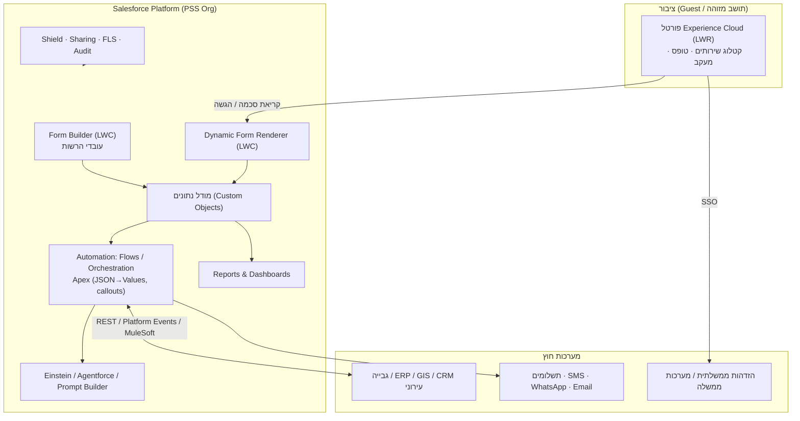
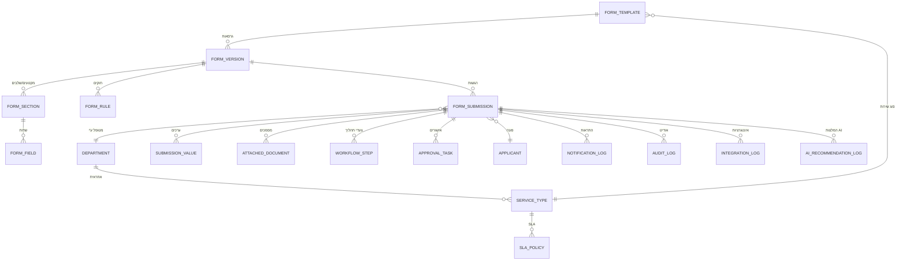

# מחולל טפסים דיגיטליים לרשות מקומית — מסמך תכנון פתרון (Salesforce-Native)

> Solution Architecture · גרסה 1.0
> נכתב מנקודת מבט של Salesforce Solution Architect · Product Manager · UX/UI · GovTech · אבטחת מידע.
> מתבסס על ה-MVP שכבר נבנה ונפרס בארגון (`Form_Template__c`, `Form_Response__c`,
> `Form_Answer__c`, בונה LWC, מרנדר דינמי) ומרחיב אותו לפלטפורמה מלאה.

מסמכים משלימים: `FORM_BUILDER_SPEC.md`, `REPORT_GENERATOR_SPEC.md`, `NATIVE.md`, `DEPLOY.md`.

---

## 1. Executive Summary

**הצורך.** רשות מקומית מפרסמת עשרות טפסים לציבור (בקשות, רישום, תלונות, היתרים). כיום
כל טופס דורש פיתוח/ספק, אין אחידות, וקשה לעקוב ולנהל SLA. הפתרון: **פלטפורמת מחולל
טפסים שכל מחזור החיים שלה חי בתוך Salesforce** — עובד לא-טכני בונה טופס, מפרסם אותו
בפורטל ציבורי, וכל פנייה נפתחת כרשומה, מנותבת למחלקה, עוברת Workflow עם SLA, והתושב
עוקב אחר הסטטוס.

**עקרון מנחה — Native-first + PSS.** ניצול מרבי של יכולות מובנות: Experience Cloud
(פורטל), LWC/Flow (חוויית מילוי ואוטומציה), Custom Objects (מודל נתונים), Files
(מסמכים), Reports/Dashboards (מדידה), Permission Sets/Sharing (הרשאות), Shield
(אבטחה), Einstein/Agentforce (AI). רישוי Public Sector Solutions מספק את השכבה
הממשלתית (Case, BRE, Licenses & Permits) לעתיד.

**ערך.** זמן-הקמת-טופס יורד מ"פרויקט פיתוח" ל**דקות**; אחידות, נגישות (WCAG 2.2 AA),
רב-לשוניות (עברית RTL / ערבית / אנגלית), שקיפות לתושב, ובקרה תפעולית לרשות.

**המלצת מימוש (מנומקת בהמשך):** **שילוב** — LWC לבונה ולרינדור הדינמי (גמישות UX
ונגישות), **Flow** לאוטומציה ו-Workflow (ללא קוד, תחזוקה ע"י אדמין), **Custom Objects**
למודל, **Experience Cloud** לפורטל. OmniStudio אופציונלי לתהליכים מונחים מורכבים.

**מצב נוכחי (MVP חי בארגון):** בונה טפסים (LWC) → `Form_Template__c` (סכמת JSON) →
מרנדר דינמי → `Form_Response__c` → טריגר לפירוק ל-`Form_Answer__c` → ניהול ודוחות.
זהו הבסיס; המסמך מרחיב אותו למודל נורמלי, פורטל, Workflow, הרשאות, אינטגרציות ו-AI.

---

## 2. ארכיטקטורת Salesforce מוצעת



**רכיבים ותפקידם:**
| שכבה | טכנולוגיה | תפקיד |
|------|-----------|-------|
| פורטל ציבורי | Experience Cloud (LWR) + Guest User | הצגת קטלוג, מילוי, מעקב |
| בונה טפסים | LWC (פנימי) | הגדרת שדות/חוקים/תהליך ללא קוד |
| רינדור מילוי | LWC דינמי (קורא סכמה) | חוויית מילוי רב-שלבית, נגישה, RTL |
| מודל נתונים | Custom Objects | טפסים, גרסאות, הגשות, ערכים, מסמכים |
| אוטומציה | Flow + Orchestration + Apex | פתיחה, ניתוב, אישורים, SLA, התראות |
| מסמכים | Salesforce Files (ContentVersion) | העלאות, חתימות |
| מדידה | Reports & Dashboards / CRM Analytics | תפעול ו-KPI |
| אבטחה | Shield, Sharing, FLS, Restriction Rules | הגנה ובקרה |
| AI | Einstein/Agentforce/Prompt Builder/Data Cloud | יצירה, סיווג, סיכום, צ'אטבוט |
| אינטגרציה | REST/External Services/Platform Events/MuleSoft | חיבור למערכות הרשות |

---

## 3. ERD



> **מיפוי ל-MVP הקיים:** `FORM_SUBMISSION` = `Form_Response__c`, `SUBMISSION_VALUE` =
> `Form_Answer__c`, `FORM_TEMPLATE` = `Form_Template__c` (כיום מחזיק סכמה כ-JSON;
> ראו החלטת "JSON מול נורמלי" בסעיף 4).

---

## 4. מודל האובייקטים

| אובייקט | תפקיד | שדות מרכזיים | קשרים | הערות |
|---------|-------|--------------|-------|-------|
| **Form_Template__c** | הגדרת טופס | Name, External_Id (unique), Description, Status(Draft/Published/Retired), Service_Type, Current_Version | Lookup→Service_Type; MD←Version | קיים ב-MVP |
| **Form_Version__c** | גרסה בלתי-משתנה | Version_Number, Schema_JSON, Published_At, Active | MD→Template | ניהול גרסאות/rollback |
| **Form_Section__c** | מקטע/שלב | Title, Order, Visibility_Rule | MD→Version | לפירוק נורמלי (Scale) |
| **Form_Field__c** | שדה | Key, Label, Type, Required, Help, Options, MapTo, Validation, Order | MD→Section | לפירוק נורמלי (Scale) |
| **Form_Rule__c** | חוק תצוגה/ולידציה | When_Field, Operator, Value, Action, Targets | MD→Version | Conditional logic |
| **Form_Submission__c** | פנייה/הגשה | Name(Auto FR-), Status, Submitted_At, Channel, Language, SLA_Due, Department, Applicant, Response_Data(JSON) | Lookup→Version, Applicant, Department | = Form_Response__c |
| **Submission_Value__c** | ערך תשובה | Field_Key, Field_Label, Value_Text, Value_Number, Value_Date | MD→Submission | = Form_Answer__c (reportable) |
| **Attached_Document__c** | מסמך | Doc_Type, Required, ContentVersionId, Status | MD→Submission | מעל Salesforce Files |
| **Applicant__c / Contact** | פונה | Name, ID_Number(מוצפן), Email, Phone, Address | — | Person Account/Contact לתושב מזוהה |
| **Department__c** | מחלקה | Name, Queue, Manager, Email | Lookup→Queue | ניתוב |
| **Service_Type__c** | סוג שירות | Name, Category, Department, Default_SLA | Lookup→Department, SLA_Policy | קטלוג |
| **Workflow_Step__c** | צעד תהליך | Name, Order, Status, Assignee, Due | MD→Submission | תיעוד מסלול |
| **Approval_Task__c** | משימת אישור | Approver, Decision, Comments, Date | MD→Submission | או Approval Process סטנדרטי |
| **SLA_Policy__c** | מדיניות SLA | Name, Target_Hours, Business_Hours, Escalation | — | או Entitlements/Milestones |
| **Notification_Log__c** | לוג התראות | Channel(Email/SMS/WA), To, Template, Status, Sent_At | MD→Submission | |
| **Audit_Log__c** | אודיט אפליקטיבי | Actor, Action, Entity, Before/After, Timestamp | Lookup→Submission | משלים ל-Shield/Field History |
| **Integration_Log__c** | לוג אינטגרציה | System, Direction, Payload, Status, Error, Retry_Count | Lookup→Submission | |
| **AI_Recommendation_Log__c** | לוג AI | Type, Prompt, Output, Confidence, Accepted | Lookup→Submission | שקיפות/ביקורת AI |

**החלטת מפתח — סכמה כ-JSON מול נורמלי (Form_Field__c):**
- **MVP (JSON ב-Form_Version__c/Template):** מהיר, גמיש, פחות רשומות; פשוט לרינדור LWC.
- **Scale (Form_Section__c/Form_Field__c נורמלי):** דיווח/חיפוש ברמת השדה, שכפול חלקי,
  ניהול הרשאות עדין. **המלצה:** להתחיל ב-JSON (כפי שנבנה), ולעבור להיברידי — JSON
  לרינדור + `Submission_Value__c` (קיים) לדיווח; לעבור ל-`Form_Field__c` נורמלי רק
  כשנדרש דיווח/חיפוש עמוק ברמת הגדרת השדה.

**שיקולי נפח/ביצועים/ארכוב:** `Submission_Value__c` גדל מהר (שורה×שדה) → Big Objects
או ארכוב מתוזמן להגשות ישנות; אינדוקס על `External_Id`, `Status`, `Submitted_At`,
`Department`; Skinny/Custom Index דרך תמיכה לפי צורך; מסמכים ב-Files (לא Base64 בשדות).

---

## 5. Wireframes עיקריים

**בונה טפסים (פנימי):**
```
┌───────────────────────────── בונה טפסים ─────────────────────────────┐
│ כותרת: [ רישום לאירוע ]        סוג שירות: [ אירועים ▾ ]  מחלקה: [תרבות▾]│
│ ┌ שדות ────────────────────────────────────────────────┐  ┌ תצוגה ──┐ │
│ │ ⠿ [שם מלא ] סוג:[טקסט▾] ☑חובה מיפוי:[שם▾]  [🗑] │  │ שם מלא* │ │
│ │ ⠿ [אימייל ] סוג:[אימייל▾] ☑חובה מיפוי:[אימייל▾][🗑]│  │ אימייל* │ │
│ │ ⠿ [מסלול ] סוג:[בחירה▾]  אפשרויות:[בוקר/ערב]  [🗑]│  │ מסלול ▾ │ │
│ │ [+ הוסף שדה]  [+ הוסף מקטע]                          │  │ [שליחה] │ │
│ └──────────────────────────────────────────────────────┘  └─────────┘ │
│ תהליך: מחלקה[תרבות] SLA[72ש'] מסמכים[☑ת.ז] התראות[☑מייל]              │
│ [תצוגה מקדימה]   [שמור טיוטה]   [פרסם ▸]   גרסה: v3 (rollback ▾)       │
└───────────────────────────────────────────────────────────────────────┘
```

**פורטל ציבורי — קטלוג ומילוי (Mobile-First):**
```
┌───────── פורטל השירותים ─────────┐   ┌──── טופס: רישום לאירוע ────┐
│ 🔎 [ חיפוש שירות...        ]      │   │ שלב 2/3  ▓▓▓▓▓░░  (66%)   │
│ מחלקה: [הכל ▾]  נושא:[הכל ▾]     │   │ שם מלא*  [__________]      │
│ ┌──────────┐ ┌──────────┐        │   │ אימייל*  [__________]      │
│ │ רישום    │ │ תלונה    │        │   │ צריך הסעה? (◉כן ○לא)       │
│ │ לאירוע ▸ │ │ ▸        │        │   │ כתובת איסוף* [________]    │
│ └──────────┘ └──────────┘        │   │ 📎 העלאת מסמך   ✍ חתימה    │
│ [עברית | العربية | EN]           │   │ [‹ הקודם]        [המשך ›]  │
└──────────────────────────────────┘   └────────────────────────────┘
```
**מעקב סטטוס:** מספר פנייה `FR-00042` · סטטוס: *בטיפול* · מחלקה: תרבות · SLA: 2 ימים ·
כפתורים: "השלמת מסמך", "הודעה לרשות".

---

## 6. UX — עקרונות

- **Mobile-First**, נגישות **WCAG 2.2 AA** (ניגודיות, פוקוס, ARIA, ניווט מקלדת),
  **RTL** לעברית/ערבית + **LTR** לאנגלית (i18n דרך Custom Labels/Translation Workbench).
- **בונה:** Drag & Drop, תצוגה מקדימה חיה, טיוטה/פרסום, ניהול גרסאות ו-rollback,
  תבניות מוכנות ושכפול.
- **פורטל:** קטלוג עם חיפוש/סינון, מילוי רב-שלבי עם פס התקדמות, **Save & Resume**
  (טיוטה מקושרת לתושב מזוהה או ל-token), הודעות שגיאה ברורות, אישור עם מספר פנייה,
  מסך מעקב, השלמת מסמכים חסרים, ותקשורת עם הרשות.

---

## 7. תהליכי Flow מרכזיים

| תהליך | מנגנון | טריגר |
|-------|--------|-------|
| פתיחת פנייה + מיפוי + פירוק ל-Values | Apex trigger (JSON דינמי) + Record-Triggered Flow | On insert Submission |
| ניתוב למחלקה/Queue לפי Service Type | Record-Triggered (before/after save) | Insert/Update |
| חישוב SLA_Due (שעות עסקים) | Record-Triggered + Apex/Time function | Insert |
| אישורים | **Approval Process** או Flow Orchestration | הגשה/סטטוס |
| בקשת השלמת מסמכים לתושב | Screen Flow (פורטל) + Email/SMS | חוסר מסמך |
| תזכורות/הסלמות SLA | **Scheduled Flow** (או Time-Based) | חריגת SLA |
| עדכון סטטוס לתושב | Record-Triggered → Notification | שינוי סטטוס |
| תהליך רב-מחלקתי מורכב | **Flow Orchestration** | פניות מורכבות |

**מתי מה (המלצה):**
- **Record-Triggered Flow** — לוגיקת רקורד מיידית (ניתוב, שדות, סטטוס). ברירת מחדל.
- **Screen Flow** — אינטראקציה מונחית (השלמת מסמכים, טיפול מוקדן). בפורטל/פנימי.
- **Approval Process** — אישורים לינאריים פשוטים; **Flow Orchestration** — תהליך
  רב-שלבי/רב-משתתף מקבילי.
- **Scheduled Flow** — אצווה/תזכורות/הסלמות.
- **OmniStudio Integration Procedure** — אורקסטרציית קריאות שרת/אינטגרציות מורכבות
  (אם OmniStudio בשימוש). **Apex** — פירוק JSON דינמי, callouts, לוגיקה שמעבר ל-Flow.

---

## 8. מודל הרשאות ואבטחה

| פרסונה | מנגנון | גישה |
|--------|--------|------|
| תושב אנונימי (Guest) | Guest User + Permission Set + Sharing Sets | קריאת טפסים פעילים, יצירת Submission בלבד |
| תושב מזוהה | Experience Cloud Login + Person Account/Contact | הגשות שלו, מעקב, השלמת מסמכים |
| עובד מחלקה | Profile + Permission Set + Role + Queue | פניות מחלקתו, עריכת סטטוס |
| מנהל מחלקה | Permission Set Group + Role (מעל עובד) | דוחות, אישורים, הקצאה |
| מוקדן | Permission Set | פתיחה/צפייה חוצת-מחלקות מוגבלת |
| מנהל מערכת | Profile Admin | הכל |
| ספק חיצוני | Permission Set + Sharing מוגבל | פניות שהוקצו לו בלבד |

**עקרונות:** OWD ל-Submission = Private; **Sharing Rules/Criteria** לפי מחלקה;
**Restriction Rules** לצמצום נתונים רגישים; **FLS** על שדות (ת.ז/רגישים); **Sharing
Sets** לתושב מזוהה (רואה רק את הגשותיו); Guest — create-only, ללא read על נתוני אחרים
(Apex `without sharing` מבוקר). **אבטחה:** Shield Platform Encryption לשדות מזהים,
Field History Tracking + Audit Trail, MFA לעובדים, Login Flows, CSP/Trusted Sites,
הגנת ספאם (honeypot/CAPTCHA) בטופס הציבורי, ותאימות לחוק הגנת הפרטיות (ישראל)/GDPR.

---

## 9. תכנון אינטגרציות

| מערכת | כיוון | מנגנון | תדירות | שגיאות/לוג | אבטחה |
|-------|-------|--------|--------|------------|-------|
| גבייה | דו-כיווני | REST (Named Credential) / MuleSoft | On-event + nightly recon | Integration_Log + retry/queueable | OAuth2, mTLS |
| ERP | קריאה/כתיבה | Platform Events / MuleSoft | Near-real-time | DLQ + התראות | OAuth2 |
| GIS | קריאה | External Services (OpenAPI) | On-demand | timeout+fallback | API Key/מוגן |
| CRM עירוני | דו-כיווני | MuleSoft | Real-time | recon | OAuth2 |
| תשלומים | יציאה + webhook | REST + Payment Gateway | Real-time | idempotency key | PCI, tokenization |
| SMS / WhatsApp | יציאה | REST (ספק מאושר) | On-event | retry | API secret |
| Email | יציאה | Salesforce Email / API | On-event | bounce handling | SPF/DKIM |
| הזדהות ממשלתית | כניסה | SSO (SAML/OIDC) | Login | — | Federated, MFA |
| מערכות ממשלה / BI | יציאה | MuleSoft / API | Batch/stream | recon | mTLS |

**עקרונות:** Named Credentials בלבד (ללא סודות בקוד), **MuleSoft** כשכבת אינטגרציה
מרכזית לחיבורים רבים/מורכבים, Platform Events לפירוק צימוד, טיפול שגיאות עם
`Integration_Log__c` + retry (Queueable/Platform Events), ומעקב API Limits.

---

## 10. תכנון AI (Einstein / Agentforce)

| יכולת | טכנולוגיה | הערה |
|-------|-----------|------|
| יצירת טופס מ-Prompt | **Prompt Builder** + Agentforce → מייצר סכמת JSON ל-Form_Version__c | עובד מתאר, המערכת מציעה שדות/חוקים |
| הצעת שדות/ולידציות/Workflow | Prompt Builder על קטלוג קיים | קבלה/עריכה ע"י העובד; נשמר ב-AI_Recommendation_Log |
| שיפור ניסוח שאלות + תרגום he/ar/en | Prompt Templates | עקביות ונגישות לשונית |
| סיווג פנייה + ניתוב מחלקה | Einstein/Agentforce classification | מזין ניתוב ה-Flow |
| חילוץ נתונים ממסמכים | Einstein OCR / Doc AI (Data Cloud) | ממלא Submission Values |
| סיכום פנייה לעובד | Prompt Builder (Record) | חוסך זמן טיפול |
| איתור פניות חריגות | Data Cloud / CRM Analytics | anomaly detection |
| צ'אטבוט לתושב | **Agentforce** (Service) בפורטל | מענה + פתיחת פנייה |
| עוזר פנימי לעובד | Agentforce (Employee) | חיפוש נהלים, טיוטת מענה |

**ממשל AI:** כל פלט AI נשמר ב-`AI_Recommendation_Log__c` (prompt/output/confidence/
accepted) לשקיפות וביקורת; אדם באמצע (human-in-the-loop) להחלטות; Data Cloud לבסיס ידע.

---

## 11. דוחות ודשבורדים

מבוסס `Form_Submission__c` + `Submission_Value__c` (reportable) + Custom Report Types:
פניות פעילות/סגורות, הגשות לפי טופס/מחלקה/ערוץ, **אחוזי השלמה** וטפסים **נטושים**
(Started מול Submitted), **זמן מילוי** ו**זמן טיפול** ממוצעים, **חריגות SLA**, עומס
לפי מחלקה, מגמות חודשיות, ושביעות רצון (סקר CSAT). הפצה: Subscriptions מתוזמנים +
דשבורדים משותפים; CRM Analytics לניתוח מתקדם.

---

## 12. מגבלות Salesforce ושיקולים

| נושא | סיכון | מיטיגציה |
|------|-------|----------|
| Governor Limits | פירוק שדות/callouts באצווה | Bulkification, Queueable, אסינכרוני |
| Storage (Data) | ריבוי Submission_Value | Big Objects/ארכוב, JSON איפה שאין דיווח |
| File Storage | מסמכים כבדים | מגבלת גודל/סוג, אחסון חיצוני לפי צורך |
| API Limits | אינטגרציות רבות | MuleSoft, Platform Events, batching |
| Experience Cloud Licenses | עלות למשתמש מזוהה | Guest לרוב הטפסים; מזוהה רק כשנדרש |
| Guest User Permissions | הקשחת אבטחה | create-only, Sharing מחמיר, `without sharing` מבוקר |
| טפסים ארוכים/Dynamic rendering | ביצועים | חלוקה לשלבים, lazy render, מגבלת שדות למקטע |
| ניהול גרסאות | תאימות-אחורה | Form_Version בלתי-משתנה, הגשות מצביעות לגרסה |
| מגבלות Flow/Reports | מורכבות | פיצול Flows, Subflows, אינדוקס לדוחות |
| עלויות רישוי / Vendor Lock-in | תלות | תיעוד, מטא-דאטה ב-Git (קיים), API סטנדרטי, אסטרטגיית יצוא |
| תחזוקה | ידע ארגוני | ONBOARDING, CI (קיים), אדמין-first (Flow/Config) |

---

## 13. Backlog (Epics · Features · User Stories)

**E1 — בונה טפסים**
- F1.1 עורך שדות (Drag&Drop, 10+ סוגים) · F1.2 מקטעים/שלבים · F1.3 חוקי תצוגה/ולידציה
  · F1.4 טיוטה/פרסום/גרסאות · F1.5 תבניות ושכפול · F1.6 תצוגה מקדימה.
- *US:* "כעובד רשות, אני רוצה להוסיף שדה ולסמנו כחובה, כדי לאסוף מידע מדויק."
  *AC:* Given בונה פתוח, When מוסיף שדה חובה ומפרסם, Then בפורטל השדה מסומן `*` ולא ניתן
  לשלוח בלעדיו (ולידציית שרת).
- *US:* "לשכפל טופס קיים כבסיס לטופס חדש." *AC:* שכפול יוצר טיוטה חדשה עם External_Id ייחודי.

**E2 — פורטל ומילוי**
- F2.1 קטלוג+חיפוש/סינון · F2.2 מילוי רב-שלבי+פס התקדמות · F2.3 Save & Resume · F2.4
  העלאת מסמכים · F2.5 חתימה דיגיטלית · F2.6 אישור+מספר פנייה · F2.7 מעקב סטטוס · F2.8 רב-לשוני/RTL.
- *US:* "כתושב במובייל, למלא טופס בשלבים ולשמור להמשך." *AC:* טיוטה נשמרת ומשוחזרת
  לאותו תושב/token; פס התקדמות תואם שלב.
- *US:* "לקבל מספר פנייה ולעקוב אחר הסטטוס." *AC:* לאחר שליחה מוצג `FR-#####` ומסך מעקב
  מציג סטטוס/מחלקה/SLA.

**E3 — Workflow ו-SLA**
- F3.1 ניתוב למחלקה · F3.2 אישורים · F3.3 השלמת מסמכים · F3.4 SLA+הסלמות · F3.5 התראות.
- *US:* "כמנהל מחלקה, שפניות ינותבו אוטומטית לתור מחלקתי." *AC:* Submission לפי
  Service_Type משויכת ל-Queue הנכון ב-insert.
- *US:* "לקבל התראת חריגת SLA." *AC:* Scheduled Flow מסמן חריגה ושולח התראה לאחראי.

**E4 — הרשאות ואבטחה**
- F4.1 פרסונות+Permission Sets · F4.2 Sharing/Restriction · F4.3 FLS/הצפנה · F4.4 Audit/MFA.
- *US:* "כתושב מזוהה לראות רק את הגשותיי." *AC:* Sharing Set חושף לתושב את רשומותיו בלבד.

**E5 — אינטגרציות** — F5.1 תשלומים · F5.2 SMS/WhatsApp · F5.3 גבייה/ERP · F5.4 SSO ממשלתי · F5.5 Integration_Log+retry.

**E6 — AI** — F6.1 Prompt→טופס · F6.2 סיווג/ניתוב · F6.3 חילוץ מסמכים · F6.4 סיכום · F6.5 צ'אטבוט תושב.

**E7 — מדידה** — F7.1 Report Types · F7.2 דשבורדים תפעוליים · F7.3 CSAT · F7.4 טפסים נטושים.

**E8 — DevOps/תשתית** — F8.1 מטא-דאטה ב-Git (קיים) · F8.2 CI deploy+tests (קיים) · F8.3 Scratch/Sandbox · F8.4 ONBOARDING.

---

## 14. Roadmap

| שלב | תכולה | סטטוס |
|-----|-------|-------|
| **0 — יסודות** | מודל `Form_Template/Response/Answer`, טריגר, בונה LWC, מרנדר דינמי, אפליקציה פנימית, CI, פריסה ל-Sandbox | ✅ **נעשה** |
| **1 — MVP** | חוקי תצוגה/ולידציה, מקטעים/שלבים, מסמכים (Files), ניתוב למחלקה + SLA בסיסי, פורטל Experience Cloud (Guest) + מעקב, דוחות בסיס | הבא |
| **2 — תפעול מלא** | אישורים/Orchestration, השלמת מסמכים, התראות (Email/SMS), רב-לשוני מלא, חתימה, תבניות, ניהול גרסאות מתקדם | |
| **3 — אינטגרציות ותשלומים** | תשלומים, גבייה/ERP/GIS, SSO ממשלתי, MuleSoft, Integration_Log | |
| **4 — AI ואנליטיקה** | Prompt→טופס, סיווג/חילוץ/סיכום, צ'אטבוט Agentforce, CRM Analytics/Data Cloud | |

**המלצת MVP (שלב 1):** להתמקד ב-Experience Cloud לפרסום ציבורי אנונימי של הטפסים
שכבר נבנים בבונה, + מסמכים + ניתוב/SLA בסיסי + מעקב תושב — כדי להשיג ערך מלא מקצה-לקצה
לפני הרחבות.

---

## 15. חלופות מימוש והמלצה מנומקת

| רכיב | LWC | Flow | OmniStudio | המלצה |
|------|-----|------|------------|-------|
| בונה טפסים | ✅ גמיש, נגיש, Drag&Drop | ⚠ מוגבל UX | ⚠ אדמין, רישוי | **LWC** |
| רינדור מילוי | ✅ דינמי, RTL, מובייל | Screen Flow פשוט | OmniScript (מונחה) | **LWC** (OmniScript לתהליכים מורכבים) |
| אוטומציה/Workflow | ❌ קוד | ✅ ללא-קוד, תחזוקה | Integration Procedures | **Flow (+Orchestration)** |
| אינטגרציות מורכבות | Apex | מוגבל | ✅ IP | **Apex/MuleSoft** (IP אם OmniStudio) |
| פירוק JSON דינמי | — | ❌ | — | **Apex** (כפי שנבנה) |

**מסקנה:** **היברידי** — LWC (בונה+רינדור) + Flow/Orchestration (תהליך) + Apex
(JSON/אינטגרציה) + Experience Cloud (פורטל), עם OmniStudio/Agentforce כשכבות
אופציונליות לתהליכים מונחים ו-AI. זהו האיזון בין גמישות UX, תחזוקה ללא-קוד, ועלות.

---

## 16. Best Practices והחלטות תכנון

- **Native-first**: לפני כל פיתוח — סקילי `forcedotcom/sf-skills` וניצול PSS (ראו `CLAUDE.md`).
- **מטא-דאטה ב-Git + CI** (קיים): כל שינוי נפרס ונבדק (validate + Apex tests) לפני deploy.
- **ולידציה בשרת** תמיד (לא לסמוך על הלקוח); הגנת Guest מחמירה.
- **ניהול גרסאות בלתי-משתנה**: הגשות מצביעות ל-Form_Version — שינוי טופס לא שובר פניות קיימות.
- **דיווחיות**: כל תשובה גם ב-`Submission_Value__c` (reportable), לא רק JSON.
- **נגישות ורב-לשוניות מובנות** מהיום הראשון (WCAG 2.2 AA, RTL, Custom Labels/Translation).
- **תצפית**: Integration_Log/Audit_Log/AI_Recommendation_Log לשקיפות ותחזוקה.

*סוף מסמך · גרסה 1.0*
